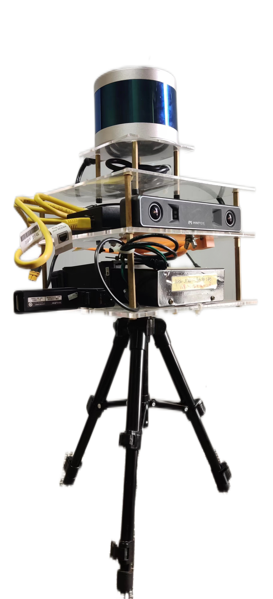
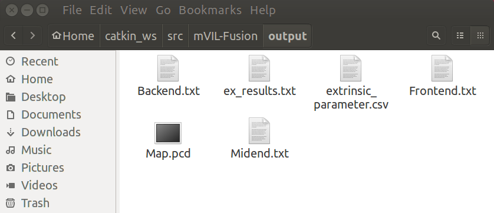

# mVIL-Fusion
Monocular Visual-Inertial-LiDAR Simultaneous Localization and Mapping in Challenging Environments
## 1. Introduction

### 1.1 Video
<p align="center">
<a href="https://youtu.be/CQOJgcNhc4c" target="_blank"></a>
</p>

### 1.2 Dataset
#### Device
<div align='center'>  </div> <br>

- MYNTEYE-D120 VI sensor                            https://www.mynteye.com/pages/mynt-eye-d
- LeiShen-C16 3d spinning LiDAR                     https://www.leishen-lidar.com/
#### Topic:
- imu_topic: `/mynteye/imu/data_raw`        200hz
- image_topic: `/mynteye/left/image_mono`   30hz
- lidar_topic: `/lslidar_point_cloud`       10hz
#### Description
| Name | Size |
| :-----| ----: |
| 3indoor.bag | 6.0G | 
| outdoor.bag | 9.1G | 
#### Download:
- Link：https://pan.baidu.com/s/1ERiMsiewaP9C9_nWbJS-9w?pwd=h9m9 <br>
- Pin：h9m9 
## 2. Usage
### 2.1 Build
```
sudo add-apt-repository ppa:ubuntu-toolchain-r/test
sudo apt-get update
sudo apt-get install gcc-7 g++-7
sudo update-alternatives --install /usr/bin/gcc gcc /usr/bin/gcc-5 60 --slave /usr/bin/g++ g++ /usr/bin/g++-5
sudo update-alternatives --install /usr/bin/gcc gcc /usr/bin/gcc-7 50 --slave /usr/bin/g++ g++ /usr/bin/g++-7

cd ~/catkin_ws/src
git clone https://github.com/Stan994265/mVIL-Fusion
cd ../
catkin_make -j1
source ~/catkin_ws/devel/setup.bash
```
### 2.2 Run Demo
```
For indoor:
roslaunch vils_estimator mynteye_leishen_indoor.launch
rosbag play ~/3indoor.bag

For outdoor:
roslaunch vils_estimator mynteye_leishen_outdoor.launch
rosbag play ~/outdoor.bag

For odometry only:
(Comment line "#define FOR_GLOBAL" in lidar_mapping/src/localMapping.cpp.)
roslaunch vils_estimator mynteye_leishen_odom.launch
```
### 2.3. Save Results
If you want to save global map, set the onboard parameter of the .launch file to 1. 
<div align='center'>  </div> <br>

